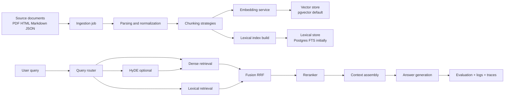
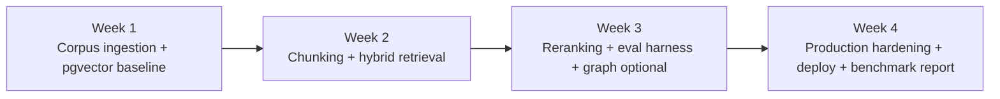

# Month 2 plan for RAG pipelines and vector data engineering

## Executive summary

The current `month-2/README.md` already defines the right end-state for this repository: a production-quality RAG stack with hybrid retrieval, reranking, evaluation, and a knowledge-graph layer, spread across the four month segments now labeled as weeks 5–8. The strongest implementation path is to keep Month 2 as a visible, standalone artifact under `month-2/`, preserve Month 1 as the foundational async API exercise, and build a new capstone service at `month-2/capstone/rag-api/` that reuses the Month 1 patterns for config, auth, logging, and provider abstraction instead of mutating the Month 1 codebase directly. citeturn31view0turn20view0

My recommendation is a **pgvector-first** Month 2 with benchmark adapters for entity["company","Pinecone","vector db vendor"] and entity["company","Weaviate","vector db vendor"] rather than attempting to productionize all three vector backends at once. That gives you the strongest portfolio signal: one serious, end-to-end retrieval system with measurable quality and operability, plus a clean evaluation harness proving you understand vendor tradeoffs. The month should be organized around four outcomes: ingestion and indexing, hybrid retrieval and chunking experiments, reranking and evals, and then deployment plus production hardening. citeturn31view0turn20view0turn21view4turn16view3

The technical baseline I would implement is this: PostgreSQL + pgvector for the default store, PostgreSQL full-text search for the initial lexical branch, Reciprocal Rank Fusion as the first hybrid baseline, one hosted embedding baseline from entity["company","OpenAI","ai company"] and one local open-weight baseline from entity["company","Hugging Face","ai platform"] model cards, a lightweight cross-encoder reranker for the default local path, and a regression-style evaluation suite using BEIR-style retrieval metrics plus Ragas retrieval and groundedness metrics. HyDE should be implemented as an experiment flag, not the default path. citeturn17view12turn17view11turn16view8turn18view0turn17view9turn16view12turn16view13turn16view14

The highest-value Month 2 success criteria are not “did the API run,” but “did retrieval improve under controlled experiments.” I would treat the month as successful only if you ship: a reproducible corpus builder, chunking sweep notebooks, embedding and reranker benchmarks, a labeled technical-doc evaluation set, hybrid retrieval with measurable gains over dense-only search, and a deployable service with query-level telemetry and tenant-safe access control. That is the difference between a tutorial repo and a job-ready retrieval engineering project. citeturn17view0turn17view4turn33view6turn33view7turn16view6turn21view0turn22view1

| Success metric | Recommended Month 2 target |
|---|---:|
| Precision@5 on hand-labeled techdocs set | ≥ 0.60 |
| Recall@10 on hand-labeled techdocs set | ≥ 0.80 |
| MRR@10 on hand-labeled techdocs set | ≥ 0.70 |
| Faithfulness on answer eval set | ≥ 0.85 |
| Context precision / recall | ≥ 0.80 / ≥ 0.80 |
| Dense-only → hybrid uplift | positive on at least 3 of 4 datasets |
| Rerank uplift over pre-rerank top-k | positive on P@5 and MRR |
| p95 retrieval latency | < 250 ms local pgvector target, excluding generation |
| p95 end-to-end answer latency | < 3 s for hosted baseline |
| Query log coverage | 100% correlation IDs and retrieval config hashes |

The table above is a recommended engineering target set built on top of the repo’s Month 2 learning goals and the standard offline and RAG evaluation surfaces used by BEIR and Ragas. citeturn31view0turn17view4turn16view12turn16view13turn16view14

## Repo-aligned scope

The repository currently describes Month 2 as the part of the curriculum where you move from a generic async API foundation to a full RAG system: week 5 for vector databases and indexing, week 6 for advanced RAG techniques such as HyDE, hybrid search, and reranking, week 7 for graph-plus-vector retrieval, and week 8 for a deployed production capstone. That structure is solid and should be kept. What is missing is the engineering plan that turns those labels into code, datasets, benchmarks, and deployment artifacts. citeturn31view0

The right implementation boundary is `month-2/capstone/rag-api/`, with supporting experiments under `month-2/notebooks/`, `month-2/benchmarks/`, and `month-2/datasets/`. Month 2 should not become a loose collection of isolated notebooks. It should become a retrieval platform with one canonical ingest pipeline, one canonical search API, one canonical evaluation harness, and adapters that let you compare infrastructure choices without rewriting business logic. citeturn31view0turn20view5

The design principle for this month should be: **measure before you optimize, and benchmark before you abstract**. Pgvector already gives you exact and approximate nearest-neighbor search, multiple distance metrics, transactional consistency, joins, and normal PostgreSQL operational patterns. That makes it the most coherent default for a repo whose Month 1 already centers on FastAPI and PostgreSQL. Managed vector stores are still worth benchmarking, but not as the first implementation target. citeturn20view0turn20view1

The architecture below is the one I would implement for the capstone service.



This flow mirrors the repo’s Month 2 goals while keeping graph retrieval as a late-month extension instead of the dependency chain that blocks the rest of the work. It also makes room for both hosted and local model backends and for repeatable offline benchmarking. citeturn31view0turn17view11turn17view12turn24view2

## Recommended architecture and technology choices

The default backend should be **PostgreSQL + pgvector**, with the code written so that `RetrieverBackend` and `RerankerBackend` can be swapped for managed services during benchmarks. The critical subtlety is that PostgreSQL’s built-in full-text search gives you `tsvector` / `tsquery` and ranking functions, but it is not the same thing as Weaviate’s built-in BM25F keyword search. So your first hybrid baseline in Postgres should be “vector + Postgres FTS + RRF,” and if you explicitly want **true BM25 in Postgres**, you should evaluate the `pg_textsearch` extension as a controlled optional track after the baseline is working. citeturn20view3turn20view4turn24view6turn30view0

| Vector DB option | Official strengths | Main tradeoffs | Month 2 verdict |
|---|---|---|---|
| pgvector | Exact + ANN search, HNSW and IVFFlat, normal SQL joins, filtering, iterative scans, ACID | More self-managed tuning; lexical branch is FTS unless you add a BM25 extension | **Default implementation target** |
| Pinecone | Dense and sparse indexes, integrated embedding, rerank APIs, namespaces for multitenancy, serverless scaling | Vendor lock-in, managed cost, some ingestion modes differ between integrated embedding and BYO vectors | **Benchmark backend** |
| Weaviate | Built-in BM25F, hybrid search, reranking modules, collection-driven configuration, native multi-tenancy | More infra to understand; cloud vs self-hosted module differences matter | **Secondary benchmark backend** |

Primary sources for the comparison above are the official pgvector README and release notes, Pinecone’s control-plane and search docs, and Weaviate’s hybrid, keyword, reranking, and multi-tenancy docs. citeturn20view0turn20view1turn19search2turn21view4turn21view0turn21view3turn16view0turn16view1turn16view4turn24view2turn24view3turn22view1

For embeddings, the strongest Month 2 plan is to test **one cheap hosted baseline, one high-quality hosted ceiling, and two open-weight local options**. The hosted baseline should be `text-embedding-3-small`; the quality ceiling should be `text-embedding-3-large`; the local baselines should be `BAAI/bge-m3` and `nomic-embed-text-v1.5`. `e5-large-v2` is worth including as an English-oriented control. citeturn16view8turn16view9turn18view5turn18view0turn18view1turn18view2turn18view3

| Embedding model | Type | Official capabilities | Best role in Month 2 |
|---|---|---|---|
| `text-embedding-3-small` | hosted | 1536 dims by default, 8192 max input, lower-cost baseline | default hosted baseline |
| `text-embedding-3-large` | hosted | 3072 dims by default, dimension shortening supported, best OpenAI embedding quality | hosted quality ceiling |
| `embed-v4.0` from entity["company","Cohere","ai company"] | hosted | multilingual, multimodal, output dimensions 256/512/1024/1536 | hosted alternative, especially for multilingual or image-rich corpora |
| `BAAI/bge-m3` | open-weight | dense + sparse + multi-vector, 100+ languages, up to 8192 tokens | best open-weight retrieval candidate |
| `intfloat/e5-large-v2` | open-weight | 1024-dim encoder, strong standard retrieval baseline | English control model |
| `nomic-embed-text-v1.5` | open-weight / API | 8192 context, Matryoshka dimensions down to 64 | local-friendly compression experiments |

The comparison above is synthesized from the official OpenAI embeddings guide and model page, Cohere’s embeddings docs, and the official model cards / API docs for BGE-M3, E5, and Nomic. citeturn16view8turn16view9turn18view5turn28view0turn28view1turn28view2turn18view0turn18view1turn18view2turn18view3turn18view4

For reranking, I would make the default local path `cross-encoder/ms-marco-MiniLM-L6-v2`, add `BAAI/bge-reranker-v2-m3` for multilingual or higher-recall runs, and keep `monoT5` as a research ablation rather than the production default. If you benchmark managed stacks, test hosted reranking in Pinecone or Cohere-powered reranking in Weaviate after the local baseline is stable. citeturn17view7turn17view8turn17view9turn18view6turn18view7turn17view10turn21view3turn24view4

| Reranker | Type | What the official docs say | Month 2 role |
|---|---|---|---|
| `cross-encoder/ms-marco-MiniLM-L6-v2` | local | trained for MS MARCO passage ranking; classic retrieve-and-rerank use | default fast reranker |
| `BAAI/bge-reranker-v2-m3` | local / hosted in some platforms | multilingual, lightweight relative to larger LLM rerankers, fast inference | stronger multilingual reranker |
| `monoT5-base-msmarco` | local | T5 passage reranker; stronger research-style reranking, slower inference | benchmark-only ablation |
| hosted Cohere / Pinecone rerank | managed | two-stage reranking integrated into search workflows | managed-service comparison |

The table above is grounded in the official Sentence Transformers docs, model cards, BGE reranker docs, MonoT5 model card, Pinecone rerank docs, and Weaviate reranker integrations. citeturn17view7turn17view8turn17view9turn18view6turn18view7turn17view10turn16view2turn21view3turn24view4turn24view5

The highest-value local model serving layer for open-weight experiments is **Text Embeddings Inference**, because it is explicitly built for embedding and sequence-classification models, exposes Prometheus metrics, and supports OpenTelemetry. If you later want one OpenAI-compatible internal model gateway, vLLM is a strong follow-on because it supports `/v1/embeddings` and other OpenAI-compatible endpoints. Ollama is the simplest laptop-friendly local option for quick checks, not the best choice for your primary benchmark environment. citeturn26view2turn25search3turn27view1turn27view2turn26view1

## Retrieval experiments and evaluation

Use **two parallel evaluation tracks**. The first is a public benchmark track for retrieval science; the second is a product track that reflects the actual documents your capstone will answer against. For the public track, use BEIR subsets for heterogeneous zero-shot retrieval, MIRACL for multilingual stress tests if you care about non-English or cross-lingual search, and HotpotQA distractor/dev slices for multi-hop behavior. For the product track, build a hand-labeled technical-doc evaluation set from Python, FastAPI, PostgreSQL, Cloud Run, and pgvector documentation, with about 100–150 queries labeled for relevance and answerability. citeturn17view1turn17view0turn17view3turn17view2

| Dataset | Why it belongs in Month 2 | How to use it |
|---|---|---|
| BEIR subsets such as SciFact / FiQA / NFCorpus | heterogeneous zero-shot retrieval baseline | compare embeddings, vector stores, rerankers |
| MIRACL | multilingual retrieval over 18 languages | optional multilingual benchmark track |
| HotpotQA | multi-hop QA with supporting facts | test retrieval depth and answer grounding |
| `techdocs_eval.jsonl` | your real portfolio/capstone workload | regression set for product decisions |

The public dataset recommendations come directly from the official BEIR, MIRACL, and HotpotQA materials; the hand-labeled technical-doc set is the necessary product complement that public corpora cannot replace. citeturn17view1turn17view0turn17view3turn17view2

Chunking needs to be treated as an experiment matrix, not a one-time configuration setting. Start with a recursive length-based baseline from LangChain, then compare it with document-element chunking from Unstructured, markdown/header-aware chunking, and parent-child retrieval. In answer assembly, explicitly test whether reordering retrieved chunks reduces long-context degradation, because “lost in the middle” effects remain real even in long-context models. citeturn17view14turn17view13turn19search0turn19search8

| Chunking strategy | What to test | Sweep values |
|---|---|---|
| Recursive character baseline | simplest baseline, strong control | 400/50, 800/120, 1200/150 |
| Unstructured element chunking | PDFs, policies, slide decks, mixed formatting | `basic`, `by_title`, max chars 800/1200 |
| Markdown / heading-aware | docs and READMEs | section title prefix on/off |
| Parent-child retrieval | retrieve fine chunk, hydrate larger parent | child 300–500, parent 1200–2000 |
| Semantic overlap window | preserve boundary context | overlap 10%, 20%, 30% |

The sweep above follows the official LangChain and Unstructured guidance that chunking exists to keep retrievable units within embedding/model limits and preserve semantically coherent units instead of arbitrary raw splits. citeturn17view14turn17view13

For retrieval experiments, run the following ablations in order: dense only, lexical only, dense + lexical with RRF, dense + lexical + rerank, and HyDE + dense + hybrid + rerank. Do not start with HyDE on by default. The HyDE paper is useful because it gives you a true unsupervised retrieval-improvement path when labels are sparse, but it adds generation cost and latency and should be proven against a cheaper non-HyDE baseline first. RRF should be your first fusion method because it has unusually strong “good baseline” characteristics in retrieval research. citeturn17view11turn17view12

The evaluation stack should separate **retrieval**, **generation**, and **operations**. For retrieval, log Precision@k, Recall@k, MRR@k, and NDCG@k using BEIR-compatible evaluators. For RAG answer quality, use Ragas metrics such as Context Precision, Context Recall, and Faithfulness. For operational health, record p50/p95 latency for embedding, vector search, lexical search, fusion, rerank, and end-to-end response time, plus dollar cost per 1,000 queries and per successful answer. citeturn17view4turn16view12turn16view13turn16view14turn17view6turn33view7

The benchmark surface should be implemented as code, not prose. I would add these notebooks and scripts immediately:

| Path | Purpose |
|---|---|
| `month-2/notebooks/01_chunking_sweep.ipynb` | compare chunking strategies on same corpus |
| `month-2/notebooks/02_embedding_benchmark.ipynb` | compare embedding models by retrieval metric and latency |
| `month-2/notebooks/03_hybrid_vs_dense.ipynb` | show recall and MRR uplift from lexical fusion |
| `month-2/notebooks/04_reranker_eval.ipynb` | compare pre-rerank vs reranked top-k |
| `month-2/notebooks/05_cost_latency_dashboard.ipynb` | aggregate p50/p95 latency and cost |
| `month-2/benchmarks/run_retrieval_eval.py` | offline metric runner |
| `month-2/benchmarks/run_rerank_eval.py` | reranker sweep |
| `month-2/benchmarks/run_latency_bench.py` | stage-by-stage latency benchmark |
| `month-2/benchmarks/make_techdocs_eval.py` | build labeled internal eval set |
| `month-2/benchmarks/report.py` | render markdown/CSV leaderboard |

Pgvector’s official setup and indexing guidance should directly inform your migration and query code. The snippet below is the Alembic-style baseline I recommend adapting. citeturn20view0turn20view1turn20view5

```python
# month-2/capstone/rag-api/alembic/versions/0001_enable_vector_and_chunks.py

from alembic import op
import sqlalchemy as sa
from pgvector.sqlalchemy import Vector

revision = "0001_month2_vector"
down_revision = None
branch_labels = None
depends_on = None

def upgrade() -> None:
    op.execute("CREATE EXTENSION IF NOT EXISTS vector")

    op.create_table(
        "documents",
        sa.Column("id", sa.BigInteger(), primary_key=True),
        sa.Column("tenant_id", sa.Text(), nullable=False, index=True),
        sa.Column("source_uri", sa.Text(), nullable=False),
        sa.Column("title", sa.Text(), nullable=True),
        sa.Column("meta", sa.JSON(), nullable=False, server_default="{}"),
        sa.Column("content_sha256", sa.Text(), nullable=False, unique=True),
        sa.Column("created_at", sa.DateTime(timezone=True), server_default=sa.text("now()")),
    )

    op.create_table(
        "chunks",
        sa.Column("id", sa.BigInteger(), primary_key=True),
        sa.Column("document_id", sa.BigInteger(), sa.ForeignKey("documents.id", ondelete="CASCADE"), nullable=False),
        sa.Column("tenant_id", sa.Text(), nullable=False, index=True),
        sa.Column("chunk_index", sa.Integer(), nullable=False),
        sa.Column("text", sa.Text(), nullable=False),
        sa.Column("token_count", sa.Integer(), nullable=False),
        sa.Column("meta", sa.JSON(), nullable=False, server_default="{}"),
        sa.Column("fts", sa.dialects.postgresql.TSVECTOR(), nullable=True),
        sa.Column("embedding", Vector(1536), nullable=True),
    )

    op.create_index(
        "ix_chunks_embedding_hnsw",
        "chunks",
        ["embedding"],
        postgresql_using="hnsw",
        postgresql_ops={"embedding": "vector_cosine_ops"},
    )
    op.create_index(
        "ix_chunks_fts_gin",
        "chunks",
        ["fts"],
        postgresql_using="gin",
    )

def downgrade() -> None:
    op.drop_index("ix_chunks_fts_gin", table_name="chunks")
    op.drop_index("ix_chunks_embedding_hnsw", table_name="chunks")
    op.drop_table("chunks")
    op.drop_table("documents")
    op.execute("DROP EXTENSION IF EXISTS vector")
```

For hybrid retrieval in PostgreSQL, start with vector + FTS + RRF. Only after that baseline is correct should you add a true BM25 extension for comparison. citeturn20view3turn20view4turn17view12turn30view0

```sql
WITH dense AS (
    SELECT id, row_number() OVER (
        ORDER BY embedding <=> :query_embedding
    ) AS rank_dense
    FROM chunks
    WHERE tenant_id = :tenant_id
    LIMIT 50
),
lexical AS (
    SELECT id, row_number() OVER (
        ORDER BY ts_rank_cd(fts, plainto_tsquery('english', :query_text)) DESC
    ) AS rank_lex
    FROM chunks
    WHERE tenant_id = :tenant_id
      AND fts @@ plainto_tsquery('english', :query_text)
    LIMIT 50
),
fused AS (
    SELECT
        COALESCE(dense.id, lexical.id) AS id,
        COALESCE(1.0 / (60 + rank_dense), 0.0) +
        COALESCE(1.0 / (60 + rank_lex), 0.0) AS rrf_score
    FROM dense
    FULL OUTER JOIN lexical USING (id)
)
SELECT c.id, c.text, f.rrf_score
FROM fused f
JOIN chunks c ON c.id = f.id
ORDER BY f.rrf_score DESC
LIMIT 10;
```

## Four-week roadmap

The roadmap below maps cleanly onto the current Month 2 structure: Week 1 corresponds to repo week 5, Week 2 to repo week 6, Week 3 to repo week 7, and Week 4 to repo week 8. The key change is priority: graph work becomes a controlled extension after retrieval metrics are stable, not before. citeturn31view0



### Week 1

| Day | Focus | Concrete tasks | Deliverable |
|---|---|---|---|
| Monday | skeleton | scaffold `month-2/capstone/rag-api`, copy config/logging/auth patterns from Month 1, add retriever/provider interfaces | running service shell |
| Tuesday | schema | add `documents`, `chunks`, `ingest_jobs`, `retrieval_runs`; enable `vector`; add FTS columns and indexes | Alembic migration |
| Wednesday | ingestion | parsers for markdown/html/json/pdf text path, normalization, dedupe by SHA, chunker v1 | local ingest CLI |
| Thursday | embeddings | wire hosted embedding adapter and one local adapter, batch embedding worker, backfill command | first indexed corpus |
| Friday | baseline query | `/v1/retrieval/search` dense-only endpoint, offline eval runner, small benchmark on BEIR subset and techdocs | baseline retrieval report |

### Week 2

| Day | Focus | Concrete tasks | Deliverable |
|---|---|---|---|
| Monday | lexical branch | add Postgres FTS index build, lexical search endpoint, retrieval config hashing | lexical baseline |
| Tuesday | fusion | implement RRF, hybrid endpoint, over-fetch controls, score logging | dense vs lexical vs hybrid comparison |
| Wednesday | chunking sweeps | recursive, title-aware, Unstructured element chunking, parent-child retrieval | chunking notebook |
| Thursday | HyDE | add HyDE query-rewrite path behind feature flag, track added tokens and latency | HyDE ablation |
| Friday | benchmark pass | run BEIR subset, MIRACL optional, techdocs eval; freeze first leaderboard | Week 2 benchmark report |

### Week 3

| Day | Focus | Concrete tasks | Deliverable |
|---|---|---|---|
| Monday | rerankers | add cross-encoder local reranker and hosted reranker interface | rerank-ready retrieval |
| Tuesday | rerank experiments | compare no rerank vs MiniLM vs BGE reranker vs managed rerank | reranker notebook |
| Wednesday | RAG answer path | `/v1/rag/query`, context packing, citation surfaces, long-context reordering | grounded answer API |
| Thursday | eval harness | Ragas metrics, answer regression set, failure bucket tagging | eval dashboard |
| Friday | graph optional | minimal entity-relation extraction and graph sidecar only if core metrics already stable | optional graph spike report |

### Week 4

| Day | Focus | Concrete tasks | Deliverable |
|---|---|---|---|
| Monday | operational hardening | retries, idempotent ingest, dead-letter strategy, request timeouts, feature flags | resilient ingestion/query paths |
| Tuesday | observability | OpenTelemetry FastAPI + SQLAlchemy + HTTPX, Prometheus histograms, correlation IDs, query log schema | telemetry running locally |
| Wednesday | CI/CD | GitHub Actions for tests and smoke benchmarks, Dockerfiles, compose, Cloud Run manifests | CI green on PRs |
| Thursday | deployment | Cloud Run service for query API, Cloud Run Job for ingestion, Secret Manager integration | deployed staging stack |
| Friday | capstone wrap | benchmark summary, architecture doc, runbook, demo script, README polish | production Month 2 artifact |

## File-level change list

This is the file-level change list I would implement. The paths assume you keep Month 2 self-contained while enabling root-level CI where necessary.

| Path | Action | Why it exists |
|---|---|---|
| `month-2/README.md` | modify | replace syllabus-only text with implementation guide, commands, and leaderboard links |
| `month-2/week-5/README.md` | add/modify | indexing notes, pgvector benchmark results |
| `month-2/week-6/README.md` | add/modify | chunking, hybrid, HyDE, reranking experiments |
| `month-2/week-7/README.md` | add/modify | graph sidecar spike and design notes |
| `month-2/week-8/README.md` | add/modify | deployment, runbook, final benchmark summary |
| `month-2/datasets/README.md` | add | dataset download instructions, licensing notes |
| `month-2/datasets/techdocs_eval.jsonl` | add | hand-labeled product eval set |
| `month-2/notebooks/01_chunking_sweep.ipynb` | add | chunking experiment notebook |
| `month-2/notebooks/02_embedding_benchmark.ipynb` | add | embedding model comparison |
| `month-2/notebooks/03_hybrid_vs_dense.ipynb` | add | hybrid fusion analysis |
| `month-2/notebooks/04_reranker_eval.ipynb` | add | reranker comparisons |
| `month-2/notebooks/05_cost_latency_dashboard.ipynb` | add | latency and cost analytics |
| `month-2/benchmarks/configs/*.yaml` | add | frozen benchmark configs |
| `month-2/benchmarks/run_retrieval_eval.py` | add | offline retrieval metrics |
| `month-2/benchmarks/run_rerank_eval.py` | add | reranker sweep runner |
| `month-2/benchmarks/run_latency_bench.py` | add | p50/p95 stage timing |
| `month-2/benchmarks/make_techdocs_eval.py` | add | internal eval-set builder |
| `month-2/benchmarks/report.py` | add | markdown and CSV leaderboard export |
| `month-2/capstone/rag-api/pyproject.toml` | add | package / tool config |
| `month-2/capstone/rag-api/Makefile` | add | developer commands |
| `month-2/capstone/rag-api/app/main.py` | add | FastAPI entrypoint |
| `month-2/capstone/rag-api/app/config.py` | add | typed settings |
| `month-2/capstone/rag-api/app/db/models/*.py` | add | document, chunk, ingest, eval models |
| `month-2/capstone/rag-api/app/db/session.py` | add | async sessions |
| `month-2/capstone/rag-api/app/ingest/*.py` | add | loaders, parsers, cleaners, chunkers |
| `month-2/capstone/rag-api/app/embeddings/*.py` | add | provider adapters and batching |
| `month-2/capstone/rag-api/app/retrieval/*.py` | add | dense, lexical, hybrid, HyDE, parent-child |
| `month-2/capstone/rag-api/app/rerank/*.py` | add | local and hosted reranker adapters |
| `month-2/capstone/rag-api/app/evals/*.py` | add | BEIR-style and Ragas evaluators |
| `month-2/capstone/rag-api/app/api/routes/ingest.py` | add | ingestion endpoints |
| `month-2/capstone/rag-api/app/api/routes/retrieval.py` | add | search endpoints |
| `month-2/capstone/rag-api/app/api/routes/rag.py` | add | answer endpoint |
| `month-2/capstone/rag-api/app/api/routes/evals.py` | add | evaluation endpoints |
| `month-2/capstone/rag-api/app/observability/*.py` | add | traces, metrics, query logs |
| `month-2/capstone/rag-api/alembic/versions/*.py` | add | vector + FTS + tenant schema |
| `month-2/capstone/rag-api/docker-compose.yml` | add | local Postgres, Redis, TEI optional |
| `month-2/capstone/rag-api/deploy/cloudrun/service.yaml` | add | query service manifest |
| `month-2/capstone/rag-api/deploy/cloudrun/job.yaml` | add | ingestion job manifest |
| `month-2/capstone/rag-api/tests/integration/*.py` | add | ingest, retrieval, rerank, eval flows |
| `.github/workflows/month2-ci.yml` | add | lint, unit, integration, smoke benchmarks |
| `.github/workflows/month2-nightly-bench.yml` | add | scheduled benchmark sweeps |

The file plan above turns the repo’s Month 2 curriculum into a deliverable that looks and feels like an engineering project rather than a notebook archive. citeturn31view0turn33view5turn33view4

Recommended API surfaces for the capstone service are:

| Endpoint | Purpose |
|---|---|
| `POST /v1/ingest/sources` | register source documents or corpus manifests |
| `POST /v1/ingest/jobs` | trigger parse/chunk/embed/index |
| `GET /v1/ingest/jobs/{job_id}` | observe ingestion progress |
| `POST /v1/retrieval/search` | dense, lexical, or hybrid retrieval |
| `POST /v1/retrieval/rerank` | rerank arbitrary candidate lists |
| `POST /v1/rag/query` | retrieve, assemble context, generate response |
| `POST /v1/evals/run` | run offline eval bundle |
| `GET /v1/evals/{run_id}` | retrieve benchmark results |
| `GET /health/live` | liveness |
| `GET /health/ready` | DB / cache / model backend readiness |

## Deployment, observability, and security

The cleanest deployment split is **Cloud Run service for online queries** and **Cloud Run Job for ingestion and backfills**. Google’s docs distinguish these two modes sharply: services listen for web traffic, while jobs run work to completion and exit. That is exactly the shape of a RAG platform, where ingest is batch-oriented and query answering is latency-sensitive. Schedule recurring reindex or benchmark jobs with Cloud Scheduler only after the manual job path works. citeturn33view0turn33view8turn33view1turn33view2

For query serving on entity["company","Google Cloud","cloud provider"], do not leave Python concurrency at an arbitrary default and hope for the best. Cloud Run supports configurable per-instance concurrency, with defaults that can be too high for CPU-heavy or thread-starved Python services. Start with concurrency around 8 for the RAG API, instrument p95 latency and CPU, and only move upward after load tests. For ingestion jobs, use Cloud Run Jobs rather than forcing long-running batch work through request/response infrastructure. citeturn34view0

Secrets should go through Secret Manager integration, not plaintext `.env` in production. Cloud Run supports both mounted secret volumes and environment-variable references at deploy time, so keep model keys, vector DB credentials, and third-party reranker keys out of the runtime image. citeturn33view3

For observability, instrument FastAPI automatically with OpenTelemetry, add SQLAlchemy instrumentation for DB spans, and use Prometheus histograms for stage latencies because histograms are the standard way to capture distributions such as request duration and then compute p50/p95/p99 in queries. On every query, log: query ID, tenant ID, corpus ID, embedding model, retriever backend, chunking strategy, dense top-k, lexical top-k, fusion method, reranker, final document IDs, and latency breakdown. That logging schema is what makes your experiments reproducible instead of anecdotal. citeturn33view6turn14search0turn33view7turn13search2

For tenanting, the rules are backend-specific but conceptually identical. In PostgreSQL, every retrieval table should carry `tenant_id`, row-level security should be enabled, and every retrieval query should use tenant predicates. In Pinecone, use one namespace per tenant for isolation; in its serverless design, namespaces are the official multitenancy mechanism. In Weaviate, enable multi-tenancy per collection and treat each tenant as a separate shard boundary. In all three cases, retrieval cache keys and eval artifacts must also be tenant-scoped. citeturn16view6turn16view7turn21view0turn22view1

The CI stack should do more than lint and test. GitHub Actions should run unit tests, integration tests with Postgres + pgvector, smoke benchmark jobs on a tiny corpus, notebook execution checks for one or two notebooks, and optional deployment workflows using Google’s Cloud Run action. Your nightly job should rerun a reduced benchmark matrix so you can catch silent quality regressions when you change chunking, reranking, or embedding providers. citeturn33view5turn33view4turn14search3

The small command set below is the one I would standardize in the README and Makefile. The pgvector image, Cloud Run secret syntax, and managed-provider API surfaces are all documented in official docs.

```bash
# local pgvector
docker pull pgvector/pgvector:pg18-trixie

# app
docker build -t month2-rag-api ./month-2/capstone/rag-api
alembic upgrade head

# local benchmarks
python -m month_2.benchmarks.make_techdocs_eval
python -m month_2.benchmarks.run_retrieval_eval --config month-2/benchmarks/configs/pgvector_openai.yaml
python -m month_2.benchmarks.run_rerank_eval --config month-2/benchmarks/configs/pgvector_bge.yaml
python -m month_2.benchmarks.run_latency_bench --config month-2/benchmarks/configs/staging.yaml

# Cloud Run service
gcloud run deploy month2-rag-api \
  --image $IMAGE_URL \
  --region $REGION \
  --concurrency 8 \
  --update-secrets=OPENAI_API_KEY=openai-api-key:latest

# Cloud Run job
gcloud run jobs create month2-rag-ingest \
  --image $IMAGE_URL \
  --region $REGION
```

The key external API surfaces worth explicitly testing during Month 2 are these: Pinecone `POST /indexes`, `POST /records/namespaces/{namespace}/search`, `POST /rerank`, and `GET /models`; local Ollama `POST /api/embed`; and vLLM’s OpenAI-compatible `/v1/embeddings`. Those interfaces let you evaluate managed and local embedding paths without rewriting the application-facing retrieval code. citeturn29search25turn16view1turn16view2turn24view1turn26view1turn27view1

A minimal CI workflow template should look like this:

```yaml
name: month2-ci

on:
  pull_request:
  push:
    branches: [main]

jobs:
  quality:
    runs-on: ubuntu-latest
    services:
      postgres:
        image: pgvector/pgvector:pg18-trixie
        env:
          POSTGRES_PASSWORD: postgres
          POSTGRES_DB: rag
        ports: ["5432:5432"]
    steps:
      - uses: actions/checkout@v4
      - uses: actions/setup-python@v5
        with:
          python-version: "3.12"
      - run: pip install -U pip
      - run: pip install -e ./month-2/capstone/rag-api[dev]
      - run: pytest month-2/capstone/rag-api/tests -q
      - run: python -m month_2.benchmarks.run_retrieval_eval --config month-2/benchmarks/configs/smoke.yaml

  deploy-staging:
    if: github.ref == 'refs/heads/main'
    needs: quality
    runs-on: ubuntu-latest
    steps:
      - uses: actions/checkout@v4
      - uses: google-github-actions/deploy-cloudrun@v2
        with:
          service: month2-rag-api
          image: ${{ secrets.IMAGE_URL }}
          region: ${{ secrets.GCP_REGION }}
```

This month becomes genuinely job-ready if you leave it with three things: a working RAG service, a benchmark harness that can prove why its settings are the way they are, and an operational surface that looks like something a real team could extend. The repo’s current Month 2 direction is correct; what it needs is stricter prioritization, stronger evaluation discipline, and a file layout that treats retrieval as a production subsystem rather than a collection of experiments. citeturn31view0turn17view4turn33view6turn33view7turn33view0