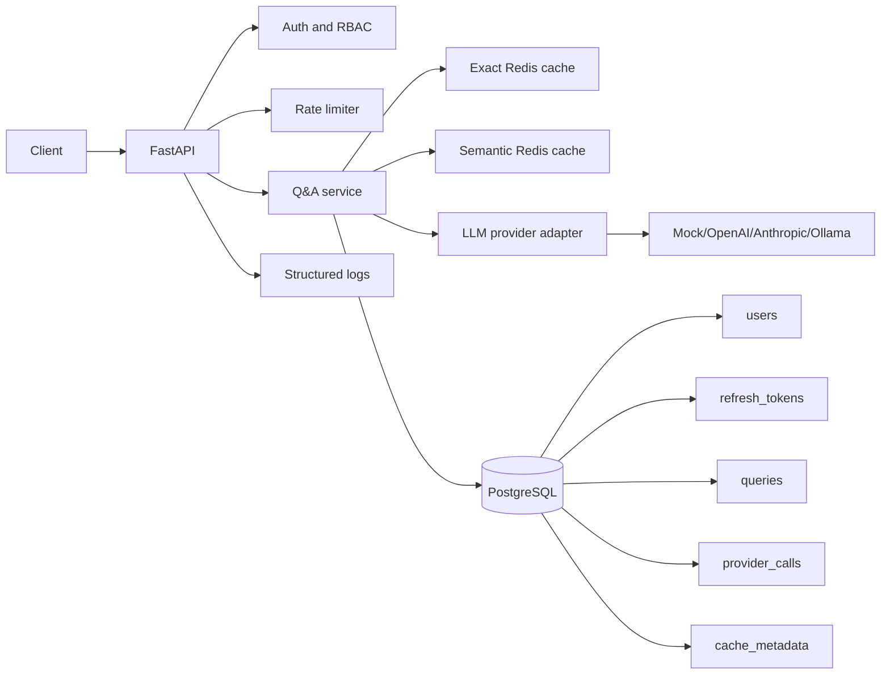

# Month 1 Capstone: Production Q&A API

## Purpose

Build the API foundation that Months 2-4 will extend. This capstone is a production-shaped backend for answering user questions through a cache-first LLM provider flow.

The goal is not to build RAG yet. The goal is to prove you can build the backend layer that a RAG or agent system can trust.

## User Story

As an authenticated user, I can ask a question. The system checks whether it has already answered the same or a semantically similar question. If yes, it returns the cached answer. If not, it calls a configured LLM provider, stores the result, logs cost and latency, and returns a structured answer.

As an admin, I can inspect cache stats, query stats, and service health.

## Required Architecture



## Required Stack

| Area | Requirement |
|---|---|
| Project management | `uv`, `pyproject.toml`, lockfile |
| Runtime | Python 3.12+ |
| API | FastAPI with lifespan-managed resources |
| Settings | `pydantic-settings` |
| Validation | Pydantic v2 request and response models |
| Database | PostgreSQL, SQLAlchemy async, Alembic |
| Cache | Redis exact cache and semantic cache |
| Auth | JWT access and refresh tokens |
| Passwords | Argon2 or bcrypt hashing |
| Provider abstraction | mock, OpenAI, Anthropic, optional local provider |
| HTTP client | shared `httpx.AsyncClient` with timeouts |
| Logging | `structlog` structured JSON logs |
| Retries | bounded provider retries with `stamina` or equivalent |
| Tests | pytest, pytest-asyncio, httpx test client, respx |
| Local runtime | Docker Compose |

## Required Project Structure

```text
qa-api/
  app/
    __init__.py
    main.py
    config.py
    lifespan.py
    dependencies.py
    logging.py
    errors.py
    routers/
      auth.py
      health.py
      qa.py
      users.py
      admin.py
    schemas/
      auth.py
      errors.py
      health.py
      qa.py
      users.py
      admin.py
    models/
      database.py
    repositories/
      users.py
      refresh_tokens.py
      queries.py
      provider_calls.py
      cache_metadata.py
    services/
      auth.py
      qa.py
      cache.py
      rate_limit.py
    providers/
      base.py
      mock.py
      openai.py
      anthropic.py
      ollama.py
      registry.py
    clients/
      http.py
      redis.py
      db.py
  alembic/
  docs/
    architecture.md
    demo-script.md
    decisions/
    benchmarks/
  tests/
    conftest.py
    test_auth.py
    test_health.py
    test_qa.py
    test_cache.py
    test_providers.py
  .env.example
  Dockerfile
  docker-compose.yml
  Makefile
  pyproject.toml
  README.md
```

## Required Endpoints

| Method | Path | Auth | Description |
|---|---|---|---|
| GET | `/health/live` | none | Process is running |
| GET | `/health/ready` | none | DB and Redis are reachable |
| POST | `/auth/register` | none | Create user |
| POST | `/auth/login` | none | Issue access and refresh tokens |
| POST | `/auth/refresh` | refresh token | Rotate access token |
| POST | `/auth/logout` | bearer token | Revoke refresh token/session |
| GET | `/users/me` | bearer token | Current user |
| POST | `/qa/ask` | bearer token | Main Q&A endpoint |
| GET | `/qa/history` | bearer token | Current user's query history |
| GET | `/admin/cache/stats` | admin | Cache hit rate and entries |
| DELETE | `/admin/cache` | admin | Clear cache namespace |
| GET | `/admin/query-stats` | admin | Latency, provider, and cache stats |

## Required Data Model

Minimum PostgreSQL tables:

| Table | Purpose |
|---|---|
| `users` | identity, role, tier, password hash |
| `refresh_tokens` | revocable session/token state |
| `queries` | user question, answer, cache outcome, latency |
| `provider_calls` | provider/model/tokens/cost/status/retry metadata |
| `cache_entries` | cache key, namespace, TTL, metadata |

Minimum indexes:

- `users.email` unique.
- `refresh_tokens.token_hash` unique.
- `queries(user_id, created_at)`.
- `provider_calls(query_id)`.
- `cache_entries(cache_key)`.
- `cache_entries(namespace, created_at)`.

## `/qa/ask` Required Flow

```text
1. Authenticate user.
2. Validate question payload.
3. Enforce rate limit by tier.
4. Generate normalized cache key.
5. Check exact Redis cache.
6. If exact hit, persist query with cache_outcome=exact_hit and return.
7. Check semantic cache.
8. If semantic hit, persist query with cache_outcome=semantic_hit and return.
9. Build provider request.
10. Call provider through provider interface with timeout and bounded retry.
11. Persist provider call metadata.
12. Store answer in exact and semantic cache.
13. Persist query history.
14. Return structured answer.
```

Response shape:

```json
{
  "answer": "string",
  "cache": {
    "outcome": "miss",
    "similarity": null,
    "matched_query": null
  },
  "provider": {
    "name": "mock",
    "model": "mock-chat",
    "input_tokens": 12,
    "output_tokens": 48,
    "estimated_cost_usd": 0.0
  },
  "latency_ms": 123.4,
  "request_id": "..."
}
```

## Required Observability

Every `/qa/ask` request should log:

- `request_id`
- `user_id`
- `route`
- `cache_outcome`
- `provider`
- `model`
- `input_tokens`
- `output_tokens`
- `estimated_cost_usd`
- `latency_ms`
- `retry_count`
- `status`
- `error_type` when failed

## Required Tests

| Test file | Required coverage |
|---|---|
| `test_health.py` | live and ready checks |
| `test_auth.py` | register, login, refresh, logout, `/users/me`, admin rejection |
| `test_qa.py` | cache miss, exact hit, semantic hit, provider failure, auth failure |
| `test_cache.py` | TTL, namespace, threshold behavior, stats |
| `test_providers.py` | mock provider, provider factory, timeout/retry behavior |

Tests must run in mock provider mode with no live API keys.

## Required Documentation

Add:

- `README.md` with setup, endpoints, architecture, demo flow, tests, and limitations.
- `docs/architecture.md` with Mermaid diagram.
- `docs/demo-script.md` with exact commands for a reviewer.
- `docs/decisions/0001-tooling-choices.md`.
- `docs/decisions/0002-fastapi-project-structure.md`.
- `docs/decisions/0003-provider-adapter-pattern.md`.
- `docs/decisions/0004-semantic-cache-design.md`.
- `docs/decisions/0005-cloud-run-deployment-target.md`.
- `docs/benchmarks/cache-threshold-sweep.md`.
- `docs/benchmarks/qa-api-latency.md`.

## Evaluation Criteria

### Must Have

- [ ] App starts locally.
- [ ] `/docs` renders.
- [ ] Health endpoints work.
- [ ] Auth flow works end to end.
- [ ] RBAC blocks non-admin users from admin endpoints.
- [ ] `/qa/ask` works with mock provider and no API key.
- [ ] Exact cache hit path works.
- [ ] Semantic cache hit path works.
- [ ] Cache miss path calls provider adapter.
- [ ] Query history is stored.
- [ ] Provider-call metadata is stored.
- [ ] Tests pass.
- [ ] Docker Compose starts API, PostgreSQL, and Redis.

### Quality Bar

- [ ] Error responses use one consistent envelope.
- [ ] Provider calls have explicit timeouts.
- [ ] Retries are bounded and logged.
- [ ] Logs include cost and latency fields.
- [ ] Cache threshold is documented with a tiny benchmark.
- [ ] README explains what is intentionally not in Month 1.
- [ ] ADRs explain the major tradeoffs.

## Not Doing In This Capstone

- Full document ingestion.
- RAG over user documents.
- LangChain or LangGraph.
- MCP.
- Multi-agent workflows.
- Fine-tuning.
- Frontend UI.

Those belong in later months.

## Month 2 Handoff

Month 2 should be able to reuse:

- FastAPI structure.
- Auth and RBAC.
- Settings.
- Error envelope.
- Async PostgreSQL.
- Redis.
- Provider abstraction.
- Query/provider telemetry.
- Docker and test workflow.

If Month 2 has to rebuild those from scratch, Month 1 is not finished.
