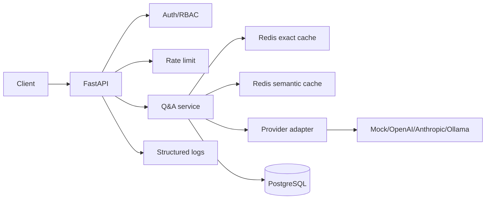

# Month 1 Capstone: Q&A API

Production-shaped FastAPI Q&A API for learning the backend layer of AI engineering.

This service is the Month 1 proof of work. It should run in mock mode without external API keys, then optionally use hosted providers once the local path is tested.

## Learning Goals

- Build a clean async FastAPI service.
- Validate inputs and settings with Pydantic v2.
- Use JWT auth and RBAC.
- Persist users, query history, provider calls, and cache metadata in PostgreSQL.
- Use Redis for exact and semantic cache paths.
- Call LLMs through a provider adapter, not directly from routes.
- Log request ID, cache outcome, provider, model, latency, tokens, and estimated cost.
- Test the service without live LLM calls using mock providers and HTTP mocking.

## Current Target Architecture



## Required Endpoints

| Method | Path | Purpose |
|---|---|---|
| GET | `/health/live` | process liveness |
| GET | `/health/ready` | DB and Redis readiness |
| POST | `/auth/register` | create account |
| POST | `/auth/login` | issue access and refresh tokens |
| POST | `/auth/refresh` | rotate access token |
| POST | `/auth/logout` | revoke session |
| GET | `/users/me` | current user |
| POST | `/qa/ask` | ask a question |
| GET | `/qa/history` | current user's query history |
| GET | `/admin/cache/stats` | admin cache stats |
| DELETE | `/admin/cache` | admin cache clear |
| GET | `/admin/query-stats` | admin query/provider stats |

## Local Development

Use `uv` for the capstone.

```bash
uv sync --extra dev
```

Copy environment variables:

```bash
copy .env.example .env
```

Start dependencies:

```bash
docker compose up -d
```

Run migrations:

```bash
uv run alembic upgrade head
```

Run the API:

```bash
uv run uvicorn app.main:app --reload --host 0.0.0.0 --port 8080
```

Run checks:

```bash
uv run ruff check .
uv run ruff format --check .
uv run mypy app
uv run pytest
```

## Demo Flow

1. Start Postgres and Redis.
2. Run migrations.
3. Start the API.
4. Open `/docs`.
5. Register a user.
6. Login and copy the access token.
7. Call `/qa/ask` once and verify `cache.outcome = "miss"`.
8. Call `/qa/ask` again with the same question and verify `cache.outcome = "exact_hit"`.
9. Call `/qa/ask` with a similar question and verify semantic cache behavior.
10. Call `/qa/history`.
11. Login as admin and inspect cache/query stats.

## Required Logs For `/qa/ask`

Every request should emit structured fields:

- `request_id`
- `user_id`
- `cache_outcome`
- `provider`
- `model`
- `input_tokens`
- `output_tokens`
- `estimated_cost_usd`
- `latency_ms`
- `retry_count`
- `status`
- `error_type`

## Required Docs Before Month 2

```text
docs/
  architecture.md
  demo-script.md
  decisions/
    0001-tooling-choices.md
    0002-fastapi-project-structure.md
    0003-provider-adapter-pattern.md
    0004-semantic-cache-design.md
    0005-cloud-run-deployment-target.md
  benchmarks/
    cache-threshold-sweep.md
    qa-api-latency.md
```

## Month 1 Done Means

- The app runs locally in mock provider mode.
- Tests pass without API keys.
- Exact cache and semantic cache are demonstrable.
- Query history and provider calls are persisted.
- Logs show cache, provider, cost, and latency data.
- The README and ADRs explain the tradeoffs clearly.
