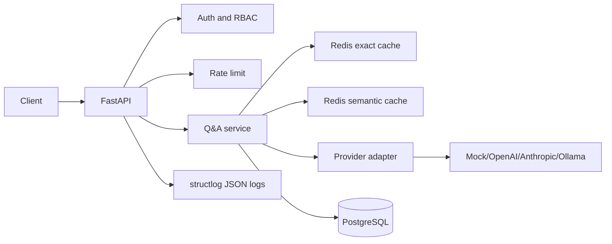

# Month 1 Q&A API Architecture

## Request Flow

## Core Decisions

- Cache is checked before provider calls.
- Provider calls go through an adapter interface.
- PostgreSQL stores durable metadata and query history.
- Redis stores fast cache entries and rate-limit buckets.
- Tests run with `DEFAULT_PROVIDER=mock`.

## Failure Modes

| Failure | Behavior |
|---|---|
| Redis unavailable | readiness fails; Q&A can degrade to provider miss path if configured |
| PostgreSQL unavailable | readiness fails; write endpoints return error envelope |
| Provider timeout | bounded retry, then provider error response |
| Invalid provider response | do not cache; persist failed provider-call metadata |
| Rate limit exceeded | return 429 error envelope |
