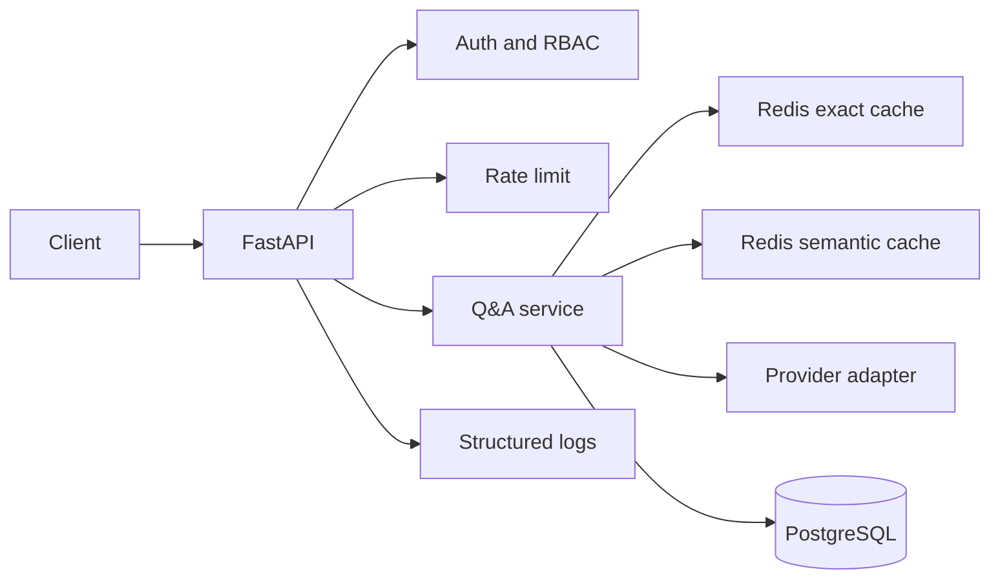

# Day 19: AI System Design

## Goal

Turn the capstone into a system you can explain in an interview. The output should become `month-1/capstone/qa-api/docs/architecture.md`.

## Build

Create a short design note with:

1. Architecture diagram.
2. Request flow for `/qa/ask`.
3. Data model summary.
4. Failure-mode table.
5. Cost-driver table.
6. Scaling notes.
7. Not-doing list.

## Starting Diagram

## Required Failure Modes

| Failure | Expected behavior |
|---|---|
| Redis down | Skip cache, call provider if allowed, log degraded mode |
| PostgreSQL down | `/health/ready` fails; write endpoints fail clearly |
| Provider timeout | Retry if safe, then return provider error envelope |
| Provider malformed output | Validate response, log provider error, do not cache |
| Rate limit exceeded | Return clear 429 error envelope |
| Invalid token | Return 401 without leaking auth internals |

## Required Cost Drivers

- Provider input tokens.
- Provider output tokens.
- Embedding calls.
- Redis memory.
- PostgreSQL storage.
- Cache hit rate.
- Retry rate.

## Done When

- Diagram is in Mermaid.
- Failure modes are explicit.
- You can explain how Month 2 RAG will attach to this API foundation.
