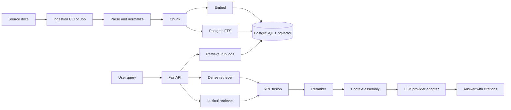

# Month 2 Capstone: Retrieval Engineering Platform

## Purpose

Build a production-shaped RAG service that compounds on Month 1. The capstone should prove you can ingest documents, retrieve relevant chunks, generate grounded answers with citations, and measure whether retrieval improved.

The main artifact is `month-2/capstone/rag-api/`.

## User Story

As an authenticated user, I can query a tenant-specific corpus and receive an answer grounded in retrieved chunks with citations.

As an admin, I can ingest documents, inspect retrieval quality, and compare dense, lexical, hybrid, and reranked retrieval.

## Architecture



## Required Stack

| Area | Requirement |
|---|---|
| API | FastAPI patterns from Month 1 |
| Settings | `pydantic-settings` |
| Database | PostgreSQL + pgvector |
| Lexical search | PostgreSQL FTS |
| Vector search | exact pgvector first; HNSW only after benchmark |
| Fusion | Reciprocal Rank Fusion |
| Reranking | interface with mock/local/hosted implementation |
| Embeddings | mock first, OpenAI or local model optional |
| Generation | Month 1 provider adapter pattern |
| Evaluation | precision@k, recall@k, MRR, NDCG, Ragas-style metrics |
| Logging | `structlog` structured logs |
| Tests | pytest, pytest-asyncio, respx, mock providers |
| Deployment shape | Cloud Run service + Cloud Run Job-ready ingestion CLI |

## Required Endpoints

| Method | Path | Auth | Description |
|---|---|---|---|
| GET | `/health/live` | none | process liveness |
| GET | `/health/ready` | none | DB/Redis readiness |
| POST | `/v1/ingest` | admin | enqueue or run small document ingest |
| GET | `/v1/documents` | user | list tenant documents |
| DELETE | `/v1/documents/{id}` | admin | delete document and chunks |
| POST | `/v1/search` | user | return ranked chunks and trace |
| POST | `/v1/answer` | user | return answer with citations |
| GET | `/v1/evals/runs` | admin | list benchmark/eval runs |
| POST | `/v1/evals/run` | admin | run smoke benchmark |

## Required Data Model

Minimum tables:

| Table | Purpose |
|---|---|
| `documents` | tenant, source, title, metadata, content hash |
| `chunks` | chunk text, token count, fts, embedding, config hash |
| `retrieval_runs` | query, config hash, stage latencies, selected chunk IDs |
| `retrieval_results` | per-chunk dense/lexical/fused/rerank scores |
| `answer_runs` | answer text, citations, provider/model, cost, latency |
| `eval_sets` | named golden sets |
| `eval_cases` | question, reference answer, relevant chunk IDs |
| `eval_runs` | metric outputs for a retrieval config |

Required indexes:

- `documents(tenant_id, content_sha256)` unique.
- `chunks(document_id, chunk_index)` unique.
- `chunks(tenant_id)`.
- `chunks.fts` GIN index.
- `chunks.embedding` exact baseline; HNSW index only after benchmark.
- `retrieval_runs(tenant_id, created_at)`.

## `/v1/search` Required Flow

```text
1. Authenticate user and tenant.
2. Validate RetrievalConfig.
3. Embed query through embedding provider.
4. Run dense pgvector search with tenant filter.
5. Run PostgreSQL FTS search with tenant filter.
6. Fuse rankings with RRF.
7. Rerank top candidates if enabled.
8. Persist retrieval_run and retrieval_results.
9. Return chunks, scores, source metadata, and trace.
```

## `/v1/answer` Required Flow

```text
1. Run /search flow.
2. Assemble context from top chunks.
3. Generate answer through provider adapter.
4. Require citations to chunk IDs.
5. If context is insufficient, answer "I don't know" with reason.
6. Persist answer_run.
7. Return answer, citations, retrieval trace, provider metadata, and latency.
```

## Required Evaluation

Retrieval metrics:

- Precision@5.
- Recall@10.
- MRR@10.
- NDCG@10.
- p95 retrieval latency.

Answer metrics:

- Faithfulness.
- Response relevancy.
- Context precision.
- Context recall.
- citation coverage.

Minimum golden set:

- 20 straightforward factual questions.
- 10 section-specific questions.
- 10 multi-hop questions.
- 5 unanswerable questions.
- relevant chunk IDs for every answerable question.

## Required Documentation

Create:

```text
docs/
  architecture.md
  demo-script.md
  research-sources.md
  decisions/
    0001-pgvector-first.md
    0002-hybrid-retrieval-rrf.md
    0003-reranking-interface.md
    0004-evaluation-metrics.md
    0005-graph-rag-deferred.md
  benchmarks/
    retrieval-quality.md
    latency.md
    chunking-sweep.md
```

## Evaluation Criteria

### Must Have

- [ ] Seed corpus ingests idempotently.
- [ ] Exact pgvector search works.
- [ ] PostgreSQL FTS works.
- [ ] RRF fusion works.
- [ ] Reranker interface works in mock mode.
- [ ] `/v1/search` returns scored chunks and trace.
- [ ] `/v1/answer` returns answer with citations.
- [ ] Retrieval metrics run from command line.
- [ ] Tests run without external API keys.
- [ ] README and ADRs explain retrieval tradeoffs.

### Quality Bar

- [ ] Hybrid or reranked retrieval improves at least one metric over dense-only.
- [ ] Regression gate is documented.
- [ ] Retrieval trace stores dense score, lexical score, fused score, and rerank score where available.
- [ ] Tenant filters are applied before retrieval results are returned.
- [ ] Unanswerable questions produce safe "I don't know" responses.

## Not Doing In Month 2

- Multi-agent workflows.
- MCP.
- Fine-tuning.
- Full graph-first RAG architecture.
- Vendor-only vector DB dependency.
- Production UI.

## Month 3 Handoff

Month 3 agents should be able to call:

- `/v1/search` as a retrieval tool.
- `/v1/answer` as a grounded answer tool.
- eval reports to decide whether an agent answer is trustworthy.
