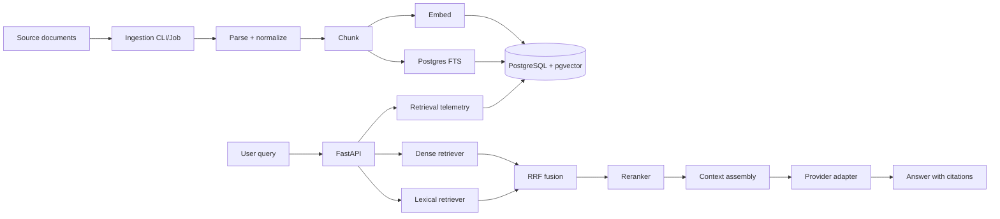

# Month 2 Capstone: RAG API

Retrieval engineering platform built on the Month 1 backend foundation.

The service should run in mock mode without external API keys, then optionally use hosted embeddings, rerankers, and generation providers for experiments.

## Learning Goals

- Ingest documents idempotently.
- Parse, normalize, chunk, and embed documents.
- Store vectors and metadata in PostgreSQL + pgvector.
- Add PostgreSQL full-text search as the lexical baseline.
- Combine dense and lexical retrieval with Reciprocal Rank Fusion.
- Rerank candidates behind an interface.
- Generate grounded answers with citations.
- Evaluate retrieval quality and answer faithfulness.
- Log retrieval traces so failures can be debugged.

## Architecture



## Local Development

```bash
uv sync --extra dev
copy .env.example .env
docker compose up -d
uv run alembic upgrade head
uv run uvicorn app.main:app --reload --host 0.0.0.0 --port 8081
```

## Checks

```bash
uv run ruff check .
uv run ruff format --check .
uv run mypy app
uv run pytest
```

## Required Endpoints

| Method | Path | Purpose |
|---|---|---|
| GET | `/health/live` | process liveness |
| GET | `/health/ready` | DB and Redis readiness |
| POST | `/v1/ingest` | ingest small document batches |
| GET | `/v1/documents` | list tenant documents |
| POST | `/v1/search` | dense/lexical/hybrid retrieval |
| POST | `/v1/answer` | answer with citations |
| POST | `/v1/evals/run` | run benchmark |
| GET | `/v1/evals/runs` | inspect benchmark runs |

## Demo Flow

1. Start PostgreSQL + pgvector and Redis Stack.
2. Run migrations.
3. Ingest the seed corpus.
4. Run `/v1/search` with dense-only config.
5. Run `/v1/search` with hybrid config.
6. Run `/v1/answer` and inspect citations.
7. Run retrieval benchmark.
8. Compare dense, lexical, hybrid, and reranked results.

## Required Docs

```text
docs/
  architecture.md
  demo-script.md
  research-sources.md
  decisions/
    0001-pgvector-first.md
    0002-hybrid-retrieval-rrf.md
    0003-reranking-interface.md
    0004-evaluation-metrics.md
    0005-graph-rag-deferred.md
  benchmarks/
    retrieval-quality.md
    latency.md
    chunking-sweep.md
```

## Done Means

- Seed corpus ingests idempotently.
- `/v1/search` returns chunks, scores, and trace data.
- `/v1/answer` returns citations.
- retrieval metrics run from a command.
- tests pass in mock mode.
- docs explain the retrieval tradeoffs.
