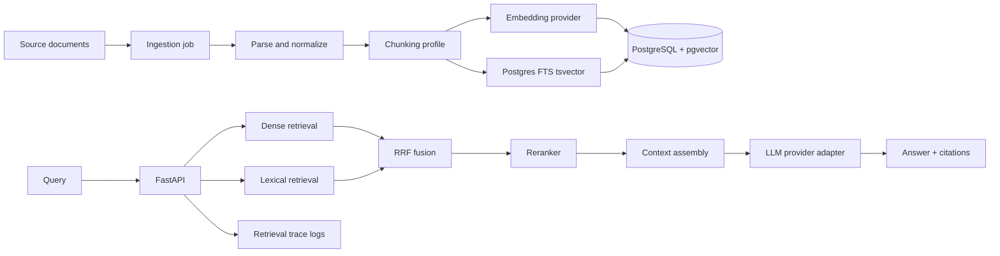

# Month 2 RAG API Architecture

## Design Notes

- pgvector is the default vector store.
- Exact vector search is the first baseline.
- PostgreSQL FTS is the lexical baseline.
- Hybrid search uses RRF so dense and lexical scores do not need the same scale.
- Reranking is optional and benchmarked.
- Graph retrieval is optional after baseline metrics are stable.
