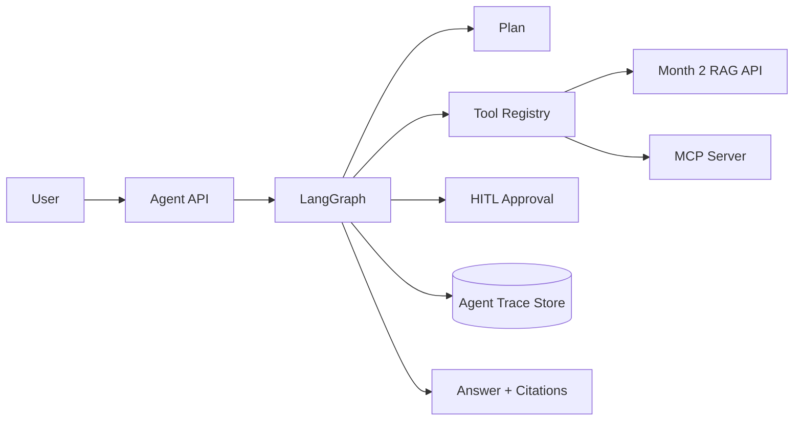

# Month 3 Capstone: Agentic RAG

Scaffold for the controlled agentic RAG capstone.

## Target Architecture

## Build Order

1. Typed graph state.
2. RAG tool wrappers.
3. Bounded LangGraph flow.
4. Trace persistence.
5. MCP server/client.
6. HITL approvals.
7. Eval suite.
8. Red-team report.
