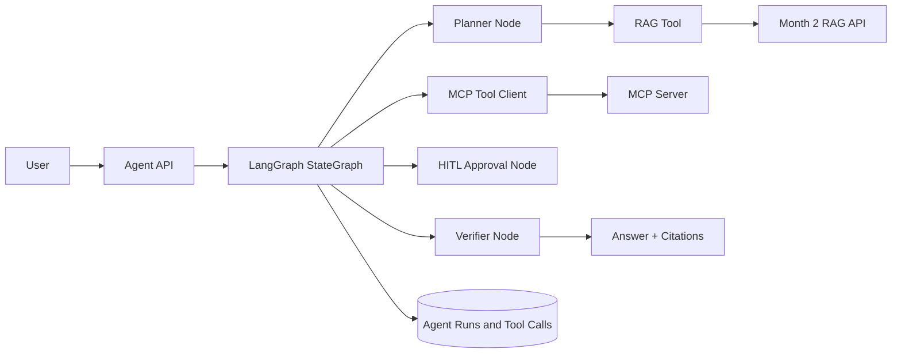

# Agentic RAG Architecture

## Design Rules

- Every loop has a max step count.
- Every tool call is typed and logged.
- High-risk tools require approval.
- Retrieval tools preserve tenant filters.
- Final answers must include citations or safe uncertainty.
