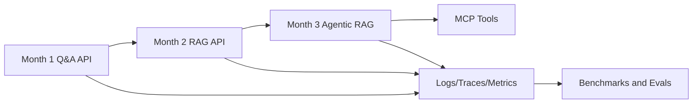

# System Architecture

```mermaid
flowchart LR
    QA[Month 1 Q&A API] --> RAG[Month 2 RAG API]
    RAG --> Agent[Month 3 Agentic RAG]
    Agent --> MCP[MCP Tools]
    QA --> Logs[Logs/Traces/Metrics]
    RAG --> Logs
    Agent --> Logs
    Logs --> Reports[Benchmarks and Evals]
```
